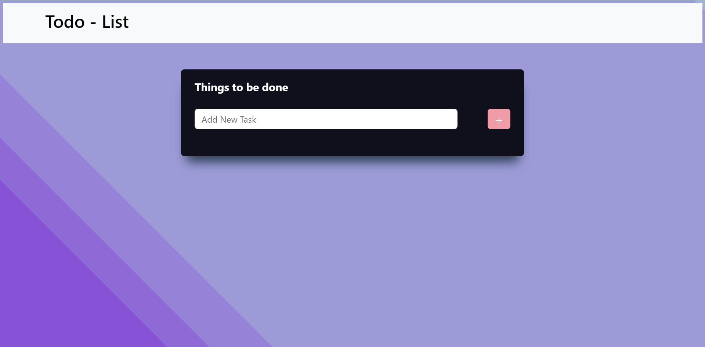
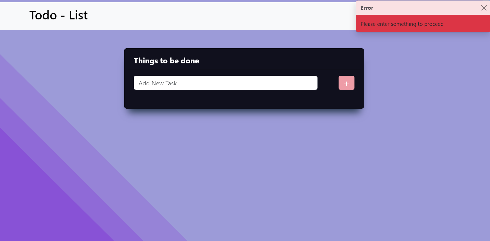
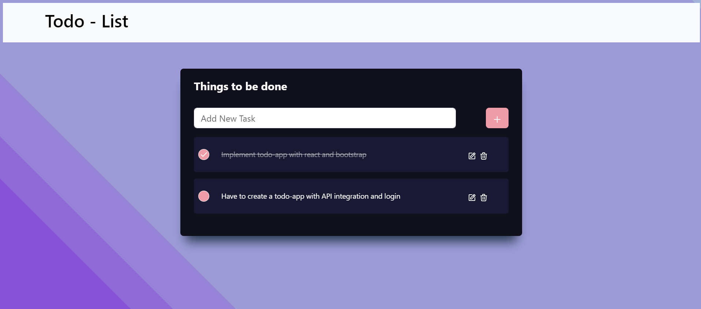

### 🤗🤗 Happing Coding 🤗🤗

### 🌐 Responsive React Bootstrap todo-list app 🌐

### Description 

- This is a react todo-list developed using bootstrap components, react icons, and using context.
- In this even a toast message will be shown when user tries to add empty to-do.
- We cannot edit the completed to-do.This can be achieved by conditional rendering.

### Demo URL
- https://vardhan-venkata.github.io/react-bootstrap-todo-app/

### Packages used

- bootstrap -> UI Library
- react-bootstrap -> for integrating in the react app
- react-scripts -> For Running scripts
- react-icons -> For the icons.

### Usage

- Clone the repository
- Do npm install to install all the dependencies
- Run the project using npm run start

### How can I appreciate this repo? 💙

- By giving this repo a 🌟
